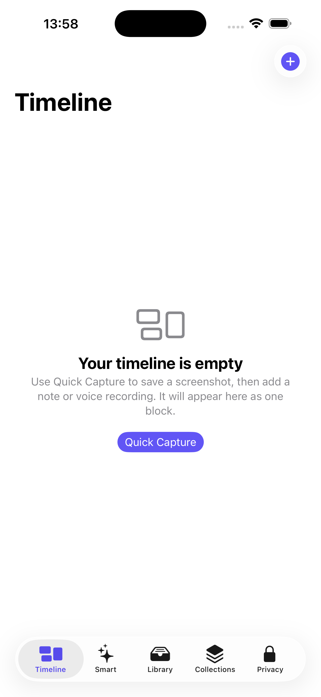

# Memory Space

Memory Space is an iPhone-only, local-first capture app for screenshots, short notes, voice notes, text extraction, and personal organisation.

It is designed for the fast flow: capture something, add your context immediately, then find it later without putting your private memories in a cloud database.



## What it does

- Capture a thought as typed text or a voice note.
- Record a voice note and create an on-device transcript.
- Take a photo or import an image, then extract its text on-device.
- Use the iPhone Action Button to take a screenshot, save it, import it into Memory Space, and immediately attach a note or voice transcript.
- Keep each screenshot with its attached notes and recordings as one Timeline block.
- Search titles, extracted text, transcripts, tags, and collections.
- Organise captures into collections and keyword-based Smart Blocks.
- Select many capture blocks at once to move, tag, add to a Smart Block, archive, or permanently delete them.
- Sync an encrypted local mirror to a nearby Mac and let a local MCP agent search it read-only.

## Privacy model

The app has no account, cloud backend, analytics SDK, or remote database.

- Captures, recordings, images, extracted text, and transcripts stay on the iPhone by default.
- Text extraction runs on the iPhone.
- Speech transcription requires an Apple on-device language model. The model may need a one-time download, but recordings are not sent to a transcription server.
- A Mac receives data only when you explicitly use **Sync to Mac**.

## Requirements

- Mac with Xcode installed.
- iPhone running iOS 17 or later.
- A free Apple ID is enough to install and test the app on your own iPhone.
- For nearby Mac sync: a Mac and iPhone close together with Wi-Fi and Bluetooth enabled.

## Install on your iPhone

1. Open [MemorySpace.xcodeproj](MemorySpace.xcodeproj) in Xcode.
2. Connect and unlock your iPhone, then select it in Xcode’s run destination menu.
3. Select the **Memory Space** target → **Signing & Capabilities**.
4. Enable **Automatically manage signing** and choose your **Personal Team**.
5. If Xcode says the bundle identifier is unavailable, change it to a unique value such as `com.yourname.memoryspace`.
6. Press **Run** (`⌘R`).

If iOS says the developer is untrusted, on the iPhone open **Settings → General → VPN & Device Management**, select your Apple ID under Developer App, then choose **Trust**.

At first use, grant only the permissions you want:

| Permission | Used for |
| --- | --- |
| Photos — **Full Access** | Importing the screenshot just saved by your shortcut; importing images |
| Microphone | Recording voice notes |
| Speech Recognition | Creating on-device voice transcripts |
| Camera | Taking a photo capture |
| Local Network | Optional nearby Mac discovery and sync |

## Everyday capture

Open **Quick Capture** from the `+` button or by running the **Quick Capture** action in Shortcuts.

- **Record a thought** creates a voice note and transcript.
- **Write note** saves a typed note.
- **Camera** takes a photo.
- **Import** chooses an image from Photos.
- **Screenshot** explains how to enable Action Button capture.

Images are saved locally first; the app then extracts readable text and creates a suggested title and basic tags.

## Set up the Action Button screenshot shortcut

This creates a capture flow similar to an Essential Space-style hardware capture key: press the Action Button, take a screenshot, then add spoken or written context directly to that screenshot.

### Create the shortcut

1. Install and open Memory Space once. This makes its **Finish Screenshot Capture** action appear in Shortcuts.
2. Open Apple’s **Shortcuts** app and tap `+`.
3. Name it something clear, such as **Save screenshot to Memory Space**.
4. Add these actions in this exact order:

   1. **Take Screenshot**
   2. **Save to Photo Album** — leave the input as the `Screenshot` output from the first action and save to **Recents**
   3. **Finish Screenshot Capture** — choose the action provided by **Memory Space**

There is no need to add **Set Variable**, **Choose File**, or **Get File**. Do not place another photo-saving action between steps 2 and 3: Memory Space imports the newest image immediately after the shortcut saves it.

### Assign it to the Action Button

On an iPhone with an Action Button:

1. Open **Settings → Action Button**.
2. Swipe to **Shortcut**.
3. Choose **Save screenshot to Memory Space**.

Each press saves the current screen to Recents, opens Memory Space, attaches that screenshot to the current Quick Capture session, and lets you add a note or voice recording. The next note or transcript is linked to that screenshot as one Timeline block.

If importing fails, check **Settings → Apps → Memory Space → Photos** and set it to **Full Access**, then run the shortcut again.

## Find and organise captures

### Timeline

The Timeline groups screenshots, notes, and voice transcripts by day. A linked note or recording is displayed under its parent screenshot.

Tap **Select** to manage multiple whole capture blocks:

- **All** selects every active Timeline block.
- **Select day** selects every block for that one day.
- **Move** sends selected blocks, including linked notes and recordings, to an existing or new collection.
- **Tags** adds and removes tags across selected blocks.
- **More → Add to Smart Block** manually adds blocks to an existing or new Smart Block.
- **More → Archive** hides blocks without deleting them.
- **More → Delete** permanently deletes selected blocks, their linked notes/recordings, and their local files after confirmation.

### Library, Collections, and Archive

- **Library** is the searchable list of active capture blocks.
- **Collections** groups capture blocks manually.
- **Smart** automatically groups captures using the text already stored locally. Smart Blocks can also contain blocks you add manually.
- **Archive** is available from the archive icon in Library. Select archived items to restore or permanently delete them.

Library, every Collection, and Archive also support **Select → All** for fast batch actions.

## Nearby Mac sync

Nearby sync uses Apple peer-to-peer discovery. It does not need an internet connection or a normal Wi-Fi network, but the Mac and iPhone must be near one another with Wi-Fi and Bluetooth on.

From the repository root, start the Mac receiver:

```sh
cd memory-space-nearby-bridge
swift run MemorySpaceNearbyBridge
```

Keep that Terminal window open. It prints the current pairing token.

Then, on the iPhone:

1. Open **Memory Space → Privacy → Sync to Mac**.
2. Paste the exact pairing token from Terminal.
3. Select the discovered nearby Mac.
4. Tap **Sync**.

The pairing token encrypts and authenticates each transfer. If it does not match, sync is rejected. Stop and restart the receiver, copy its printed token again, replace the token in the iPhone app, then retry.

The Mac mirror is stored locally at:

```sh
open "$HOME/Library/Application Support/MemorySpaceBridge"
```

It contains capture text, Smart Blocks, and compressed copies of images. Voice recordings themselves remain on the iPhone; only their transcripts are synced.

See [memory-space-nearby-bridge/README.md](memory-space-nearby-bridge/README.md) for receiver details. [memory-space-bridge/README.md](memory-space-bridge/README.md) documents the older same-Wi-Fi fallback; use it only on a trusted private network.

## Connect a local MCP agent on your Mac

After at least one successful sync, install the Node dependencies once:

```sh
cd memory-space-bridge
npm install
```

To add the read-only Memory Space server to Codex, return to the repository root and run:

```sh
codex mcp add memory-space -- node "$PWD/memory-space-bridge/src/mcp-server.mjs"
```

Start a new Codex task afterwards. It can use these local tools:

- `recent_captures` — recent screenshot groups, notes, and transcripts
- `search_memory` — text search across titles, OCR, tags, notes, and transcripts
- `list_memory_blocks` — Smart Blocks and their matching captures
- `get_capture` — a complete capture with linked items and an optional local image path

The MCP server is read-only. It starts when Codex needs it and reads only the local Mac mirror. Archived captures are excluded from normal MCP search.

## Troubleshooting

| Problem | What to check |
| --- | --- |
| Xcode cannot sign the app | Select your Personal Team and use a unique bundle identifier. |
| “Untrusted Developer” on iPhone | Trust your Apple ID in **Settings → General → VPN & Device Management**. |
| Screenshot shortcut opens Files or asks for a file | Use only **Take Screenshot → Save to Photo Album → Finish Screenshot Capture**. Do not add file-picker actions or variables. |
| Screenshot does not import | Grant **Full Access** to Photos, make sure the shortcut saves to Recents, and run it again. |
| Transcript is unavailable | Enable Speech Recognition permission; check that an on-device language model is available for the selected iPhone language. |
| Nearby Mac does not appear | Run the receiver, keep Terminal open, turn on Wi-Fi and Bluetooth on both devices, and keep them close together. |
| Nearby sync reports a pairing error | Replace the iPhone token with the exact token currently printed by the Mac receiver. |
| Codex does not show Memory Space tools | Run `codex mcp list`, then open a new Codex task. If necessary, quit and reopen Codex. |

## Local development

Build without code signing for the simulator:

```sh
xcodebuild \
  -project MemorySpace.xcodeproj \
  -scheme MemorySpace \
  -sdk iphonesimulator \
  -destination 'generic/platform=iOS Simulator' \
  CODE_SIGNING_ALLOWED=NO \
  build
```

## Repository layout

```text
MemorySpace/                   iPhone SwiftUI app
memory-space-nearby-bridge/    Native nearby Mac receiver
memory-space-bridge/           Same-Wi-Fi fallback and read-only MCP server
docs/images/                   README screenshots
```
